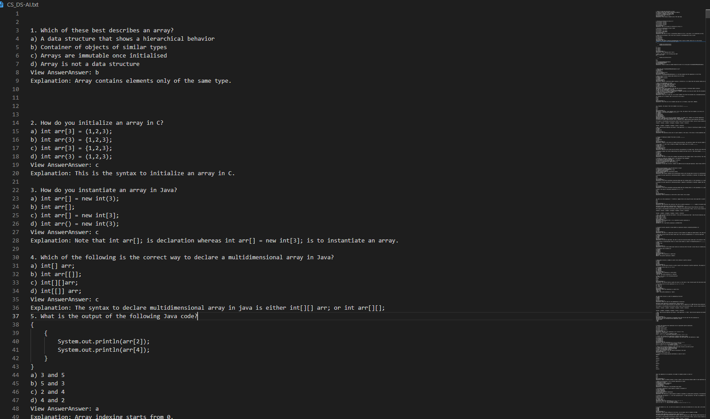

#### Sanfoundry MCQ's Parser


We are going to scrap the website data to prepare MCQ's DataSet
since all the MCQ Website are Dynamic we are using Selenium FrameWork
**Python Lib's**
* Bs4 - Web Scrapping
* Selenium - Testing Framwork 
* ChomeDirver[84.] - my browser version is 84 
[Chrome Drivers](https://sites.google.com/a/chromium.org/chromedriver/downloads)

### Using Selenium 


[Sanfoundry Selenium Script](Webscraping-selenium.ipynb)
```python
mcqlist=driver.find_elements_by_class_name('entry-content')
for mcq in mcqlist:
    print(mcq.text)
```
#### Extracting URLS
[Url Extractor](DataPre-RecursiveurlExtractor.ipynb)

```python
s = BeautifulSoup(r.text,"html.parser") 
for i in s.find_all("a"): 
    href = i.attrs['href'] 
    if href.startswith("/"): 
        site = site+href 
        if site not in  urls: 
            urls.append(site)  
            print(site) 
            geturl(site)
```
### Using BeautifulSoup

[Sanfoundry Download Script](DataPre-downloadScript.py)
```python
data=requests.get(link)
soup=BeautifulSoup(dat.text,'html.parser')
page_source=soup.findAll('p'
text=page_source[1].tex
question = re.sub('adve.+|\n\s+[a-z].+|\n\t\n', '', text)
question = re.sub('(\.)\n(\d)','\g<1>\n\n\g<2>', question
with open('CS_DS-AI.txt','a',errors="ignore") as file
    file.write(question
```